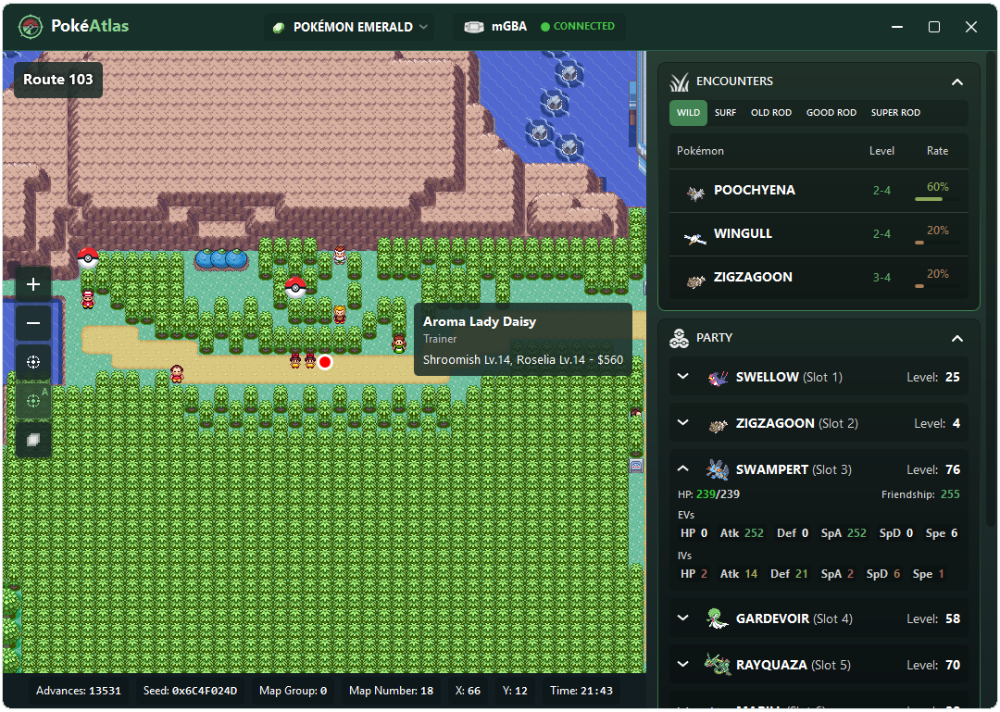
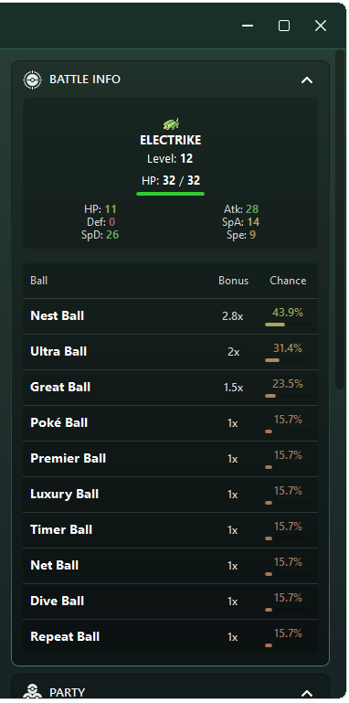
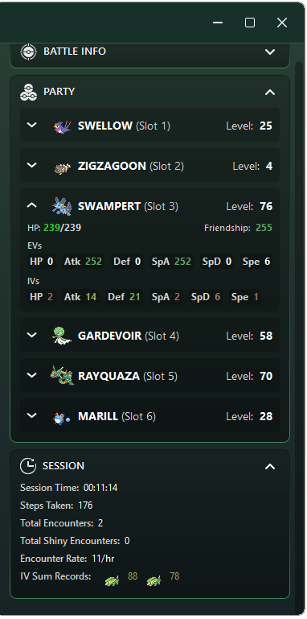

# PokéAtlas

PokéAtlas is a live companion app for Pokémon Ruby, Sapphire, and Emerald on mGBA.

## Features

- Live player position on a full Hoenn atlas
- Encounter tables with rates, levels, and sprites
- Party viewer with EVs, IVs, friendship, eggs, held items, and shinies
- Battle panel with enemy IVs, held items, shiny detection, HP, status, and catch chances
- RNG seed / advance tracking
- Session stats: time, steps, encounters, shinies, encounter rate, IV records
- Mirage Island detection
- Marine Cave / Terra Cave tracking
- Roamer location tracking
- Safari and Repel tracking
- Battle Pyramid live procedural floor rendering

## Supported Games

- Pokémon Ruby Rev.2
- Pokémon Sapphire Rev.2
- Pokémon Emerald

Other revisions may work, but are not officially tested.

## Requirements

- Windows
- mGBA
- .NET Desktop Runtime / bundled release

## Screenshots

  
  
  

## Notes

PokéAtlas reads emulator memory only. It does not modify your ROM or save file.

## Credits

- Pokémon sprites from msikma/pokesprite
- Pokémon Ruby/Sapphire/Emerald decomp projects for research/reference
